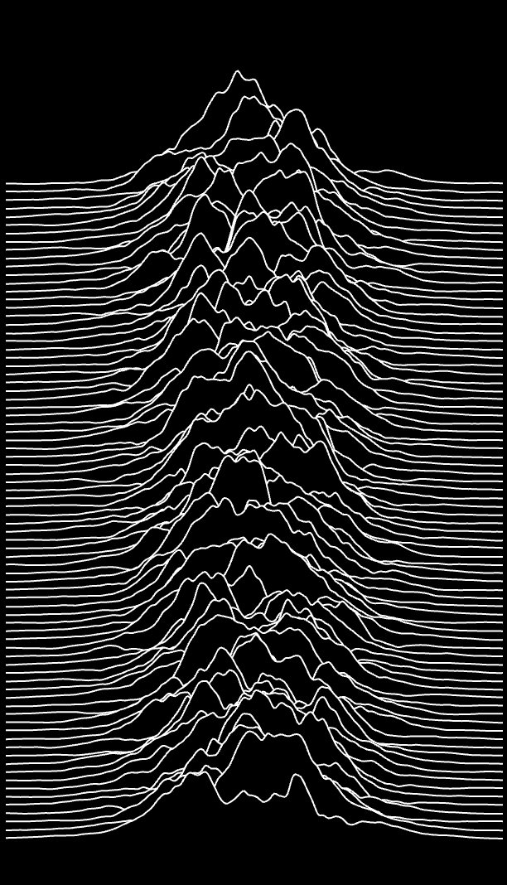

# Perlin noise and randomness Animation

## Interact
To experience the animation:

- **Move mouse slowly** across the canvas.  
  Horizontal position (`mouseX`) affects the **wave center** and noise displacement.  
  Vertical position (`mouseY`) controls the **amplitude** of the waves.

---

## My Approach to Animation
I focused on using **Perlin noise combined with mouse interaction and time** to animate both **parallel line groups** and **trapezoid shapes**. The objective was to achieve an organic, glowing, and fluid movement that evolves without harsh transitions.

---

## Animation Driver  
**Perlin Noise + Mouse Interaction + Time**

- `getAmplitudeVariance(x, y)` adds smooth, locally varying noise to vertical line positions.
- `mouseX` affects **wave center** through `xVertex0`.
- `mouseY` affects **amplitude** of deformation.
- `millis()` introduces subtle background motion even when the mouse is idle.

---

## Visual Inspirations

**Craig S. Kaplan's Line Work**  
Influenced my layered Perlin-deformed lines.  
 → [Reference Link](https://openprocessing.org/sketch/683686)
 

---

## AI Appendix  
This project benefited from the use of ChatGPT during the development process.

- `	Animation Optimization` ChatGPT helped refine the animation logic, especially in applying Perlin noise to both line groups and trapezoids. The assistant suggested using smooth mathematical formulas to control wave deformation relative to mouse position and time, improving the fluidity of interaction.
- `Glow Effect Enhancements`  I received guidance on how to layer strokes with decreasing opacity and increasing stroke weight to simulate a glowing effect, making the visuals more aesthetically pleasing.
- `Technical Explanation` ChatGPT also assisted in drafting a explaination with structured explanations of animation drivers, code logic.

